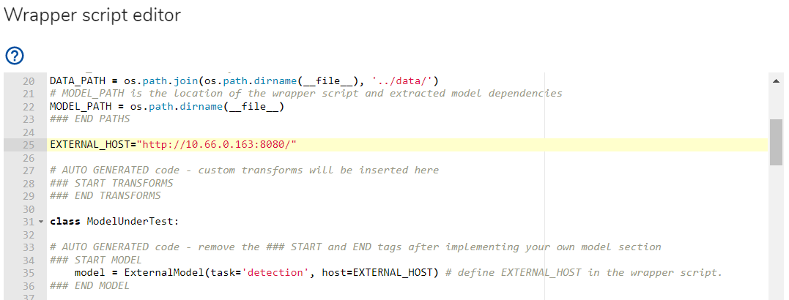

# GuardAI external API demo server

This is a demo server for the GuardAI external API. It is a simple Flask server that
serves an ONNX detection model over the GuardAI external API to allow the GuardAI platform to perform tests remotely on 
it. It is meant to be used for testing and evaluation purposes only - for performance reasons, 
please upload your model to the GuardAI platform to test it directly.
Optionally, you can also use this example to serve the dataset as well by
using the External dataset in your project.

## Requirements
Python 3.5+

## Usage
To run the server, execute the following from the project root directory, preferably in a virtual python environment:

```
pip3 install -r requirements.txt
python3 -m external_server
```

Customizations needed for your model should be made to external_server/implementation/handlers.py

On the GuardAI platform, create a new project and select "External" as the model framework type.

   

Then, edit the wrapper script to enter the URL of the server in the "EXTERNAL_HOST" variable.

   

Optionally configure the project to also use an external dataset by defining and using an ExternalDataset:

   

Note: The GuardAI platform needs to be able to reach your external server, so make sure the server is reachable 
by appropriate means (e.g. port forwarding, VPN, firewall rules, etc.)


## Running with Docker

To run the server on a Docker container, please execute the following from the root directory:

```bash
# building the image
docker build -t external_server .

# starting up a container
docker run -p 8080:8080 external_server
```
